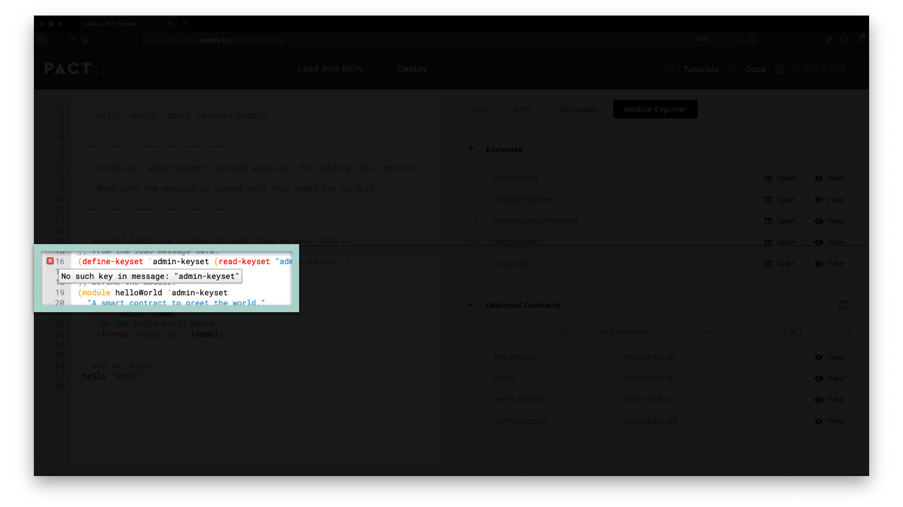
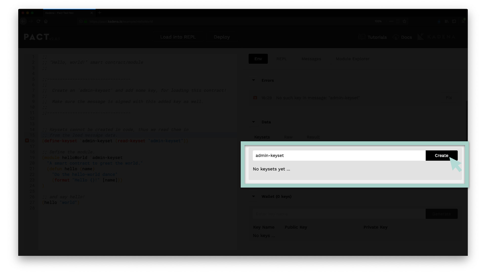
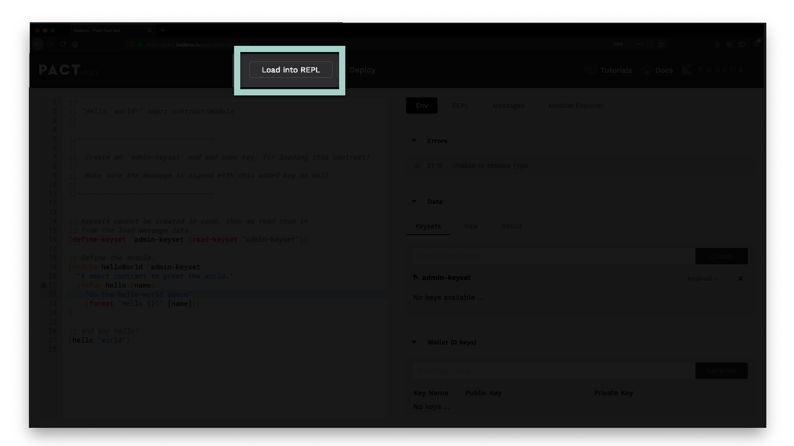
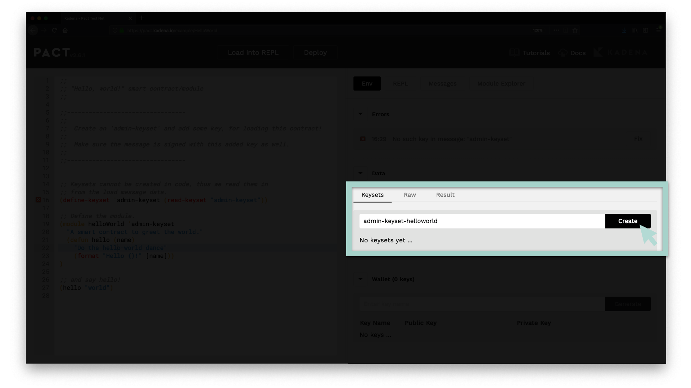
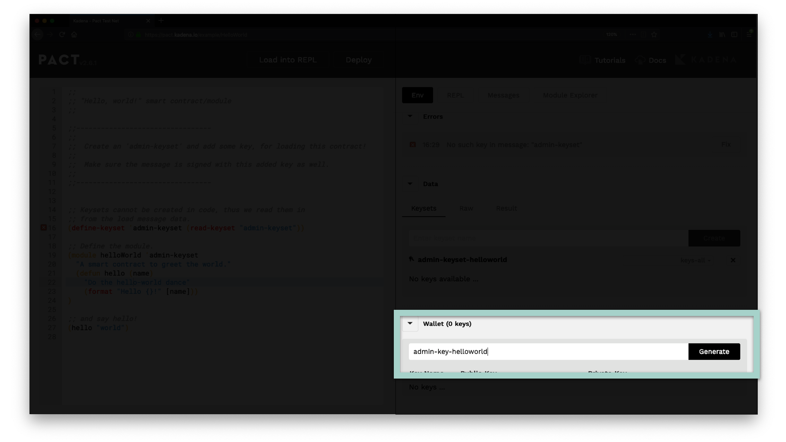
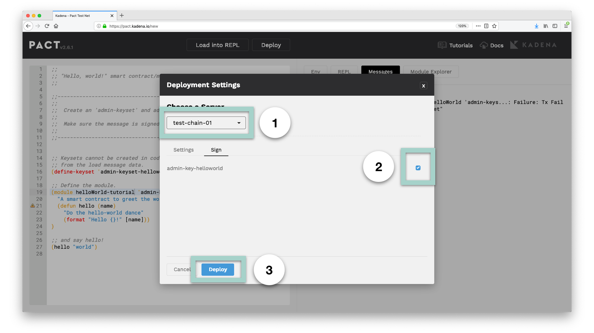
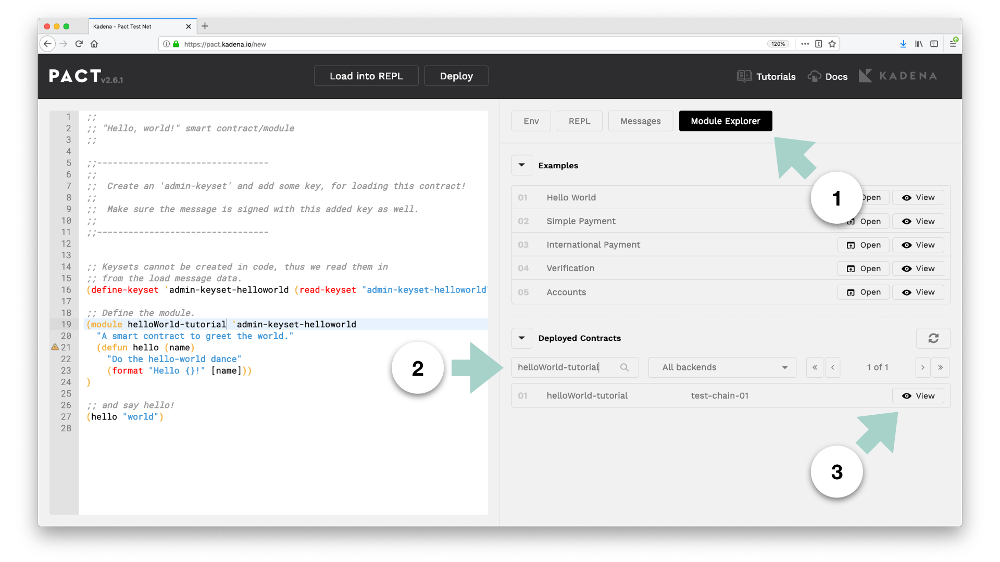
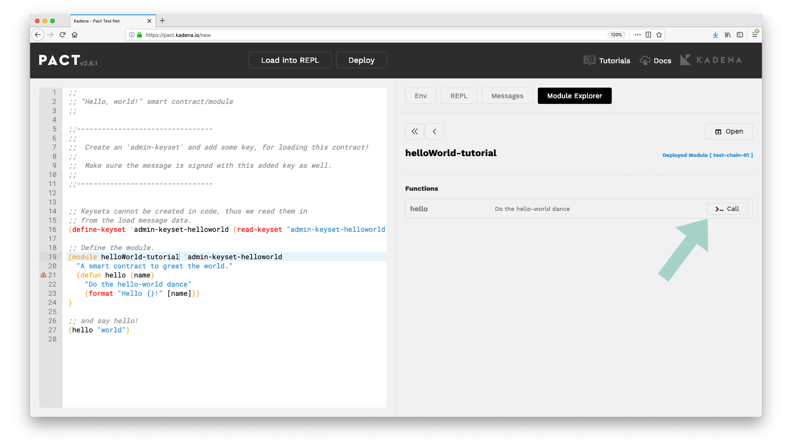
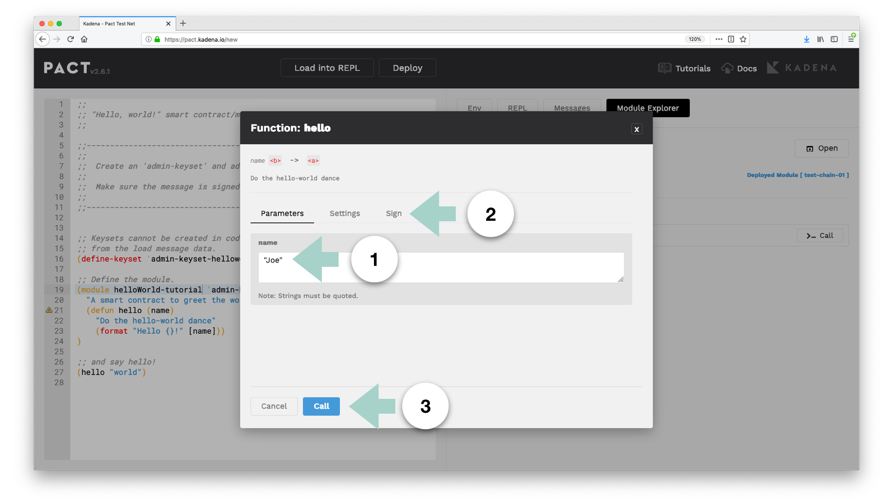
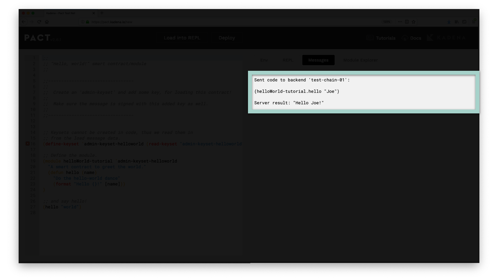

import PageRef from '@components/PageRef'
import Tabs from '@theme/Tabs';
import TabItem from '@theme/TabItem';

# Hello World with Pact

Welcome to this Hello World with Pact Tutorial!

In this tutorial, you'll learn how to create, deploy, and run functions on a Hello World smart contract with Pact.

**Topics covered in this tutorial**

- Hello World Overview
- Write the Smart Contract
- Deploy to the Testnet
- Call the Deployed Contract

The goal of this tutorial is to help you get familiar with the essential Pact concepts needed to write, deploy, and run a smart contract. Learning these concepts will help you to create more complex smart contracts later in the series.

:::note Key Takeaway

It’s simple to create and deploy a Hello World smart contract with Pact. You can deploy smart contracts from the online editor, call its functions, and view the output from the REPL.

:::

<!--truncate-->

## Hello World with Pact Tutorial

<iframe width="720" height="405" src="https://www.youtube.com/embed/bUqJJ3q-OLM" frameborder="0" allow="accelerometer; autoplay; encrypted-media; gyroscope; picture-in-picture" allowfullscreen></iframe>

Subscribe to our <a href="https://www.youtube.com/channel/UCB6-MaxD2hlcGLL70ukHotA" target="_blank">YouTube channel </a> to access the latest Pact tutorials.

## Hello World Overview

To get started, navigate to the Pact online editor at <a href="http://pact.kadena.io" target="_blank">pact.kadena.io</a>. Once on the site, you can open the “Hello World” module. To do this, navigate to the module explorer on the tool panel and open the “Hello World” example.

:::info

If you’re not familiar with the module explorer, you can learn more <a href="https://docs.kadena.io/learn-pact/beginner/web-editor#module-explorer" target="_blank">here</a>.

:::

You can also copy the code below and paste it into your editor.

```clojure
;;
;; "Hello, world!" smart contract/module
;;

;;---------------------------------
;;
;;  Create an 'admin-keyset' and add some key, for loading this contract!
;;
;;  Make sure the message is signed with this added key as well.
;;
;;---------------------------------

;; Keysets cannot be created in code, thus we read them in
;; from the load message data.
(define-keyset 'admin-keyset (read-keyset "admin-keyset"))

;; Define the module.
(module helloWorld 'admin-keyset
 "A smart contract to greet the world."
 (defun hello (name)
   "Do the hello-world dance"
   (format "Hello {}!" [name]))
)

;; and say hello!
(hello "world")

```

This code can also be found <a href="https://github.com/kadena-io/pact-examples/tree/master/hello-world" target="_blank">here</a> on our GitHub.

## Write the Smart Contract

### Create a Keyset

As you can see, the “Hello World” smart contract starts by defining and reading a keyset. <a href="https://pact-language.readthedocs.io/en/latest/pact-reference.html#confidential-keysets" target="_blank">Keysets</a> are a way to specify credentials for a user of the smart contract. The code you write within the smart contract can restrict access to users that own the keysets you define. You will see this done in the Hello World module.

Line 16 (shown below) defines and reads a keyset named admin-keyset.

```clojure

(define-keyset 'admin-keyset (read-keyset "admin-keyset"))

```

:::danger Error

If you look on line 16 line you will notice the following error. No such key in message: “admin-keyset”

:::



This error exists because you are reading a keyset that does not exist. To get rid of this error you need to create a keyset named **admin-keyset** using the panel on the right.

##### Steps to create a keyset

- Navigate to ENV > Data > Keysets from the right panel
- Enter admin-keyset
- Click Create



The error message should now be gone.

### Create the Module

Now that you have created a keyset, it’s time to build the module for your smart contract. <a href="https://pact-language.readthedocs.io/en/latest/pact-reference.html#module-declaration" target="_blank">Modules</a> are essential in Pact. They contain all the logic needed to run your smart contract.

The syntax used to create a module is shown below. This line defines a module named helloWorld. It also gives the admin-keyset access to the code within this module.

```clojure
(module helloWorld 'admin-keyset
    ;; MODULE CODE GOES HERE
)
```

### Define a Function

The next step is to create the contract functions. Functions are defined within Pact modules using the keyword <a href="https://pact-language.readthedocs.io/en/latest/pact-reference.html#defun" target="_blank">defun</a>. For this smart contract, you’ll define a function named **hello** that takes a parameter called **name**.

```clojure
(defun hello (name)
    ;; FUNCTION CODE GOES HERE
)
```

### Do The Hello World Dance

Within this function, you’ll write a formatted line to output into the REPL. You can do this using the keyword <a href="https://pact-language.readthedocs.io/en/latest/pact-functions.html#format" target="_blank">format</a>. Format allows you to manipulate strings and will help you specify the output of the function.

```clojure
(format "Hello {}!" [name])
```

This line outputs a string to the REPL that says Hello followed by the string input to the function parameter **name**.

The module for this smart contract is already complete! While this module is pretty simple, it gives you a great start to begin building more complex smart contracts.

### Say Hello World!

The final step in this smart contract is to write “Hello World” to the REPL. To do this, write a line below the module that calls the function and provide the input for name.

```clojure
(hello "world")
```

The line above calls the function **hello** and specifies the **name** as “world”. You can change this input to any name you’d like.

## Load into REPL

Having written the smart contract, you are ready to load it into the REPL.

A REPL is an interactive computing environment. It stands for read, eval, print, loop. This REPL exists within the online editor allowing you to run Pact code from within the browser.

To load a contract into the REPL, select the Load into REPL button at the top of your editor.



If everything is working correctly, you will see the REPL open up on the right side of your screen with the `Hello World` message as shown below.

```terminal

;; Welcome to the Pact interactive repl
;; Use 'LOAD into REPL' button to execute editor text
;; then just type at the "pact>" prompt to interact!
;;
;; To reset the REPL type 'reset'!
Hello world!
pact>

```

If you can see this message, your Hello World smart contract is running from within the REPL.

## Deploy to the Testnet

Loading into the REPL helps you test that your contract is working correctly, but it doesn't deploy it to a blockchain. When you're ready, you'll need to complete a few more steps to deploy your Hello World smart contract.

Here’s a quick summary of the steps needed to deploy to the blockchain.

- **Step 1:** Update Module Name
- **Step 2:** Update admin-keyset Name
- **Step 3:** Update Code
- **Step 4:** Create a Key
- **Step 5:** Set your deployment settings

### Update Module Name

First, you need to update the module name. This name needs to be unique across all module names that exist on the blockchain.

Choose any unique name you’d like. For example, my module name is helloWorld-tutorial (choose a unique name that is different than mine).

```clojure
(module helloWorld-tutorial 'admin-keyset
    ;; code goes here
)
```

:::info

This unique module name is a requirement caused by a feature in Pact that allows you to upgrade your smart contracts. You will explore this idea in further detail later when you learn about upgrading contracts.

:::

:::danger

You may come across the following error message when you attempt to deploy your contract.
`terminal ERROR: Command execution failed: (read-keyset "admin-keyset-hel...: Failure: No such key in message: "admin-keyset-helloworld" `
This error means that an existing module on the blockchain already has the name you chose. Update the module name and redeploy the contract to resolve this error.

:::

### Update admin-keyset Name

Along with a unique module name, you’ll also need a unique **keyset** name. This unique keyset ensures that only users with the keyset you define can gain access to the module. Delete the **admin-keyset** and create a new keyset with any unique name you like.

The example below shows a new keyset named **admin-keyset-helloworld**.



### Update Code

Having created a new keyset, you now need to update the code to match the name of the keyset you created. This name appears a few times in the smart contract so be careful to update each one.

```clojure

(define-keyset 'admin-keyset-helloworld (read-keyset "admin-keyset-helloworld"))

(module helloWorld-tutorial 'admin-keyset-helloworld
  (defun hello (name)
    (format "Hello {}!" [name]))
)

(hello "world")

```

### Create a Key

The purpose of the keyset is to hold keys that you can use to sign and verify your identity.

When loading the contract to the REPL you were able to get away without having this key. To deploy your contract you need to make this key.

You can create a key by completing the following steps.

- Select **Enter Key Name**
- Type the **Key name**
- Click **Generate**

A simple convention for creating your key is to name it similar to the keyset.



After creating your key, you’ll see a checkbox appear under the **admin-keyset** with the name of the key. Select this checkbox to associate this key with the keyset.

### Set your deployment settings

At the top of the screen, select **Deploy**. This will open a box that allows you to set your deployment settings.

Once in the deployment settings, select either **test-chain-01** or **test-chain-02** to deploy your contract. Next, select the checkbox to sign this deployment with the key you created. Finally, select "deploy contract".



If everything worked correctly, you should now see the string “Hello World!” appear on the right panel as a message.

At this point, you have deployed your Hello World smart contract with Pact. Congratulations!

## Call the Deployed Contract

A fantastic feature of deploying to the blockchain is that anyone can now run the deployed code. You can check for yourself and run the function available on your own “Hello World” smart contract.

### Module Explorer

To do this, you’ll need to first find the contract from the module explorer.

Start by selecting the **module explorer** from the tool panel. Once there, navigate to the **Deployed Contracts** section and type the name of your contract. The name of your contract will be the same name as the module you created. After it appears, select view to see functions that are available for your smart contract.



### Find Function

After selecting **view**, you should see the function named **hello** as an available option. Click call to open the screen that allows you to place your inputs into this function.



### Call Function

Once on the **Function: hello** screen, you’re ready to call your function.

**Steps to call a function**

- Provide a string to pass in as an input. Be sure to surround this string in quotes.
- Select the checkbox to sign this call with the key.
- Click call to call your function.



### See the Output

If everything worked out correctly, you should see the new function call appear as a new message!



Now you can you call functions on the code you’ve written, and you can call that code after it exists on the blockchain.

You can use this same idea to call functions on any other contracts that have been deployed to the blockchain. Try for yourself to see if you can make function calls on other smart contracts.

## Review

Congratulations on completing this tutorial!

Throughout this tutorial you built, deployed, and ran functions on your Hello World smart contract with Pact. You’re now prepared to play around and try anything you’d like. You can create and define new keysets, change the parameters, or add anything that comes to mind.

If you get lost, you can always go back to the module explorer to reload the original code. You can also visit the documentation using the link on the top right of the screen. Here you'll find more information about terminology, syntax, and other important ideas. If you’re up for it, you can also load in different modules using the explorer to see how a different program looks.
